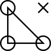

 Welcome to Fluopy
==================================================

#
#

#

Fluopy is a python-based library with code for simulating photophysical processes
of organic dyes.

For details see [documentation](README_from_Vincent.md)

Getting Started
----------------

To install the package please read the [instructions](https://locan.readthedocs.io/en/latest/source/installation.html) or:

    pip install fluopy

For details on usage and development please read the [documentation](https://locan.readthedocs.io).

[Tutorials](https://locan.readthedocs.io/en/latest/tutorials/tutorials.html) are provided as Jupyter notebooks.

Contributing
------------

Development takes place on the [Locan GitHub page](https://github.com/super-resolution/Photoswitching).

Please use [GitHub issues](https://github.com/super-resolution/Photoswitching/issues) to report bugs and feature requests. 
#Use [GitHub discussions](https://github.com/super-resolution/Photoswitching/discussions) for Q&A.

Please read [documentation on development](https://locan.readthedocs.io/en/latest/source/development.html) for details on how to help develop this project further.

Developers
----------

See the list of [contributors](https://locan.readthedocs.io/en/latest/source/contributions.html) who participated in this project.

License
-------

This project is licensed under the BSD-3 License - see the [LICENSE](LICENSE.md) file for details.

Citing
-------

If you want to acknowledge locan please cite the following publication:

Sören Doose, LOCAN: a python library for analyzing single-molecule localization microscopy data, Bioinformatics 38(9), 2670–2672, 2022,
https://doi.org/10.1093/bioinformatics/btac160

Or cite this repository using the DOI provided by zenodo:

[doi.org/10.5281/zenodo.5722472](https://doi.org/10.5281/zenodo.5722472)

Note this DOI will resolve to all versions of locan. 
To cite a specific version please find the DOI of that version on the zenodo page. 
